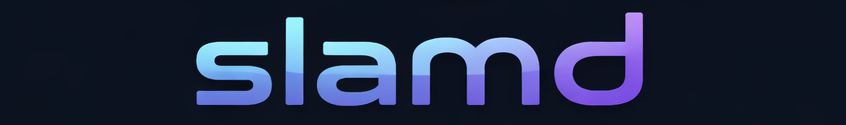

---

 

SlamDunk is a lightweight Python library for real-time 3D and 2D visualization, built on OpenGL and ImGui. `pip install`, write a few lines of Python, and you've got an interactive 3D viewer.

```bash
pip install slamd
```

**Why SlamDunk?**

- **Simple** — a few lines of Python gets you an interactive 3D viewer
- **Real-time** — update geometry on the fly from your script
- **Multi-window** — ImGui-powered docking, floating, and tabbed sub-windows
- **Lightweight** — no heavy frameworks, just OpenGL under the hood
- **Remote-capable** — optionally connect to a visualizer running on a remote machine
- **Batteries included** — point clouds, meshes, camera frustums, 2D canvases, and more

# Quick Start

```python
import slamd

vis = slamd.Visualizer("Hello world")

scene = vis.scene("scene")

scene.set_object("/origin", slamd.geom.Triad())

vis.hang_forever()
```


# Multiple Scenes

SlamDunk supports multiple sub-windows with ImGui docking. Each window can show its own scene.

```python
import slamd
import numpy as np

vis = slamd.Visualizer("two windows")

scene1 = vis.scene("scene 1")
scene2 = vis.scene("scene 2")

scene1.set_object("/box", slamd.geom.Box())

scene2.set_object("/origin", slamd.geom.Triad())

scene2.set_object("/ball", slamd.geom.Sphere(2.0))

sphere_transform = np.identity(4, dtype=np.float32)
sphere_transform[:, 3] = np.array([5.0, 1.0, 2.0, 1.0])

scene2.set_transform("/ball", sphere_transform)

vis.hang_forever()
```


Windows are fully controllable — drag them around, make tabs, float them, or dock them to the sides.

# Remote Visualization

By default, everything runs locally and you don't need to think about networking. But if you're working on a remote server (e.g. a GPU box), you can run the viewer separately on your local machine:

```bash
slamd-window --port [port] --ip [ip]
```

Just pass `spawn=False` and `port=...` to `Visualizer` on the remote side.

# Supported Geometry

### 3D

- Camera Frustums (with optional image) — `slamd.geom.CameraFrustum`
- Arrows/Vectors — `slamd.geom.Arrows`
- Arbitrary meshes — `slamd.geom.Mesh`
- Planes — `slamd.geom.Plane`
- Point Clouds — `slamd.geom.PointCloud`
- Piecewise linear curves — `slamd.geom.PolyLine`
- Spheres — `slamd.geom.Sphere`
- Triads/reference frames — `slamd.geom.Triad`

### 2D

- Images — `slamd.geom2d.Image`
- Points — `slamd.geom2d.Points`
- Piecewise linear curves — `slamd.geom2d.PolyLine`
- Circles — `slamd.geom2d.Circles`

# Installation

Wheels are available on [PyPi](https://pypi.org/project/slamd/) for Linux and macOS (Python >= 3.11):

```bash
pip install slamd
```

The only runtime dependency is `numpy >= 1.23`.

# Examples

The [examples](./examples) directory has scripts demonstrating point clouds, meshes, camera frustums, 2D canvases, animations, and more.

# Contributions

All contributions and feedback are welcome! See the [examples](./examples) to get a feel for the API, or open an issue if something's unclear.

# License

Apache 2.0 — see [LICENSE](./LICENSE).
